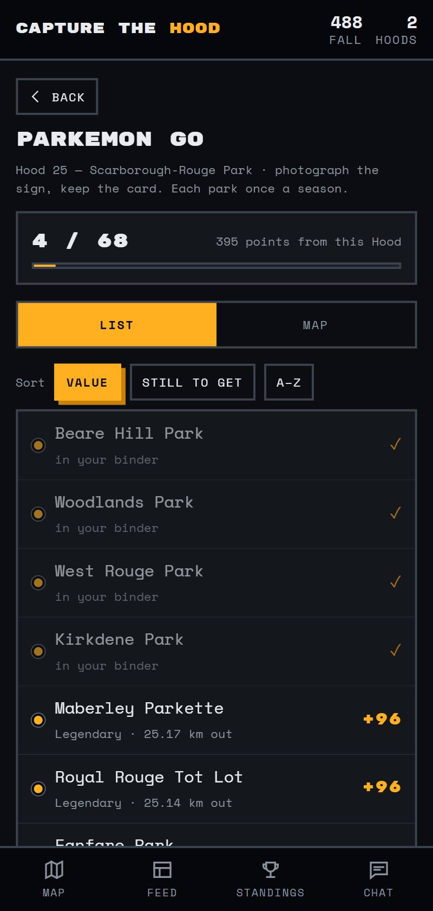
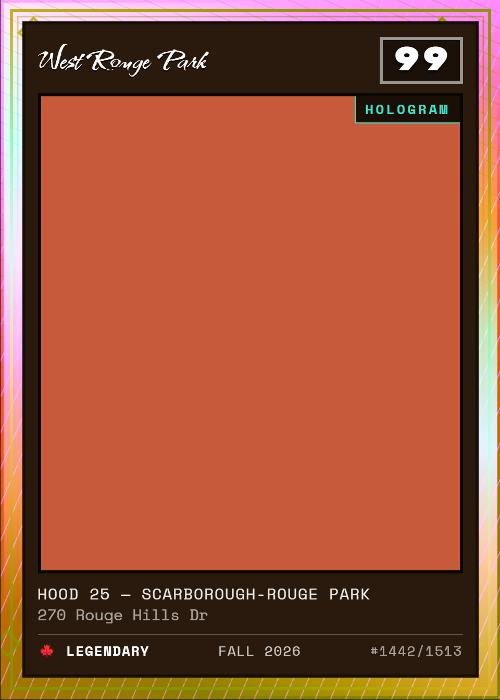
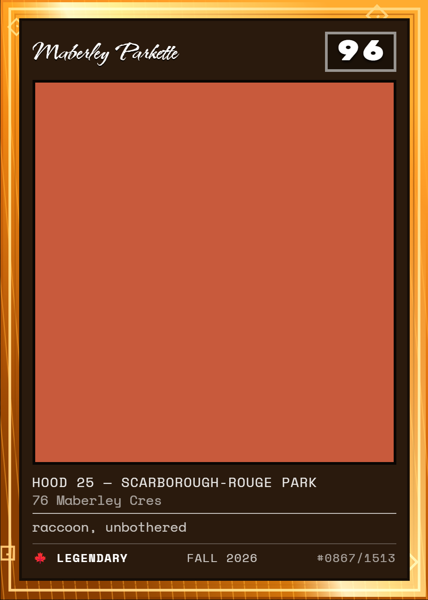
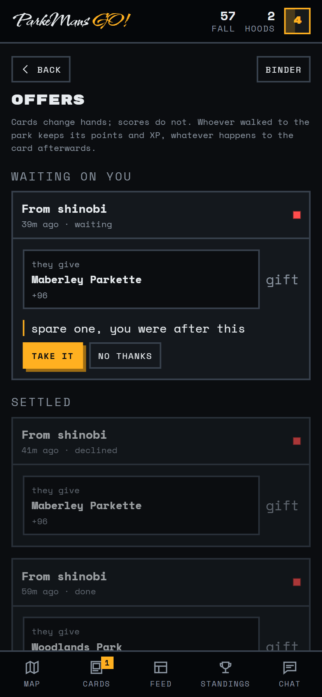
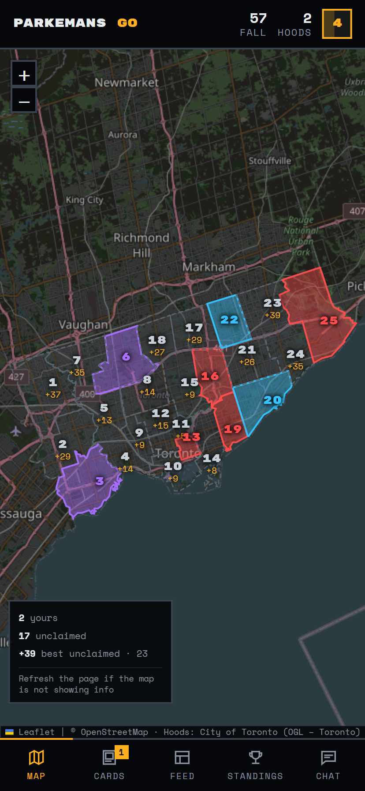

# Park-E-Mans GO!

**Six friends. One thousand five hundred and thirteen park signs. Twenty-five neighbourhoods. No referee.**

Every park in Toronto has the same municipal sign with the park's name on it. Photograph
one and you collect it, and it prints you a card. Do that 1,513 times and you have seen
the entire city.

The other half is Risk, except the board is Toronto, the armies are photographs, and the
rules are enforced entirely by people yelling at each other in a group chat. And when you
just want something to do on a walk, there's a scavenger hunt.

> It used to be called **Capture the Hood: Toronto**, back when the territory game was
> the point. Then everybody started going to parks instead, so the app is named after
> what people actually do with it.

<p align="center">
  
</p>

Every one of Toronto's 25 wards is a **Hood**. Take a photo inside one, declare what's in
it, and it's yours — until somebody takes a better photo. Whoever has the most points when
the season ends gets to be smug about it.

We never say "ward". We're not monsters.

---

## The only rule you actually need to remember

Rock, paper, scissors — but it's about **what's in the photo**, not what took it. Phone,
drone, SLR, disposable camera you found in a drawer: all equal.

```
                  landmark
                  ▲       ╲
         beats   ╱         ╲   beats
                ╱           ▼
           person ◀───────── animal
                    beats
```

| Subject | What counts | Beats | Loses to |
|---|---|---|---|
| **landmark** | buildings, monuments, streets, the shawarma place | animal | person |
| **person** | selfies, friends, a stranger who said yes | landmark | animal |
| **animal** | anything with a pulse that isn't a person | person | landmark |

Yes, "is a pigeon standing on a storefront an animal or a landmark" has already come up.
No, it has not been resolved.

## Three things you can do to a Hood

| | When | You need | You get |
|---|---|---|---|
| **Conquer** | nobody holds it | any subject | its difficulty score, 5–50 |
| **Steal** | somebody else holds it | the subject that beats theirs | double its difficulty, 10–100 |
| **Reinforce** | you hold it, 72h since its last claim | the subject that beats **your own** | a flat 25, forever |

<table>
<tr>
<td width="50%"></td>
<td width="50%"></td>
</tr>
<tr>
<td align="center"><em>kaz has downtown. You'll need an animal.</em></td>
<td align="center"><em>Pick the subject <strong>before</strong> the camera opens, so nobody walks home with a useless photo.</em></td>
</tr>
</table>

**Not all Hoods are equal.** Each carries a **difficulty score from 5 to 50**, worked out
from how far it is from City Hall and how few Hoods border it. University-Rosedale is a 5 —
you probably walked through it today. Scarborough-Rouge Park is a 50, because getting there
is a whole afternoon and everybody knows it.

**Steal from somebody and there's a 12-hour lock**, so you two can't trade the same Hood
back and forth all evening like a pair of idiots.

**Conquer empty ground and its neighbours close to you for six hours.** This rule exists
entirely because of drones. One flight should not hand somebody the whole west end.

Every one of these clocks can be bent, once, by an [item](#items) — and the Hood you're
about to steal might have a Fortify on it that only its owner can see.

---

## Parks

Every park in Toronto has the same municipal sign with the park's name on it. There are
**1,513 of them**. Photograph one and you collect that park, and it prints you a card.

<table>
<tr>
<td width="50%"></td>
<td width="50%"></td>
</tr>
<tr>
<td align="center"><em>68 parks in Rouge Park alone. Sorted by value, because you're planning a route.</em></td>
<td align="center"><em>Card #0101 of 1513. Legendary. Not for sale.</em></td>
</tr>
</table>

- Parks are worth **5–100**, purely by how far out they are
- **Each park once a season, per player.** Everybody can collect the same park. Nobody owns
  one. There is nothing to fight over. It's the calm part of the game.
- The points go into the same total as territory, so you can genuinely win this thing
  without holding a single Hood, just by walking a lot
- …but **park points stop at 300 per Hood per week.** Past that a park still prints its
  card and pays its XP, it just scores nothing. Living next to a park-dense Hood only gets
  you so far — the way to keep climbing is to go somewhere else
- **Rarity** comes off the value: Common, Uncommon, Rare, **Legendary**

### Special editions

Every collection rolls the dice. Every card is at least **Steel**; about one in seven comes
out **Gold** or better, and one in fifty is a **Hologram** — full spectrum, animated, and
there's no limit on how many anybody pulls.

| | Chance | Worth |
|---|---|---|
| Steel | 86% | +15 XP |
| Gold | 12% | +40 XP and **1 item** |
| **Hologram** | 2% | **+100 XP** and **3 items** |

<p align="center">
  
</p>

They pay **XP, never points** — so a lucky pull is a permanent brag and not a shortcut up
the table. Nobody wins a season because the dice liked them. What Gold and Hologram do hand
you is [items](#items).

The border on each card is unique to that card. The **season** picks the palette — Fall is
amber and rust, Winter goes ice blue, Spring green, Summer teal — and a seed derived from
(you, the park, the season) picks the hatch angle, the foil sweep and the corner
flourishes. Two people who collect the same park in the same season still get visibly
different cards. Legendaries get a slow sheen, because obviously they do.

<p align="center">
  
</p>
<p align="center">
  <em>A real card. Somebody walked to 455 Cosburn Avenue, photographed the sign, and got
  #0368 of 1513 — uncommon, worth 26, Fall 2026.</em>
</p>

<p align="center">
  
</p>

## Trading

Got three Corner Parkettes and no Rouge Park? Open your binder, tap a card, offer it to
somebody. Ask for one of theirs in return, or just give it away — a gift is a button,
not a hidden state.

**Trading moves the card, not the score.** Whoever actually walked to the park keeps its
points and its XP forever, however many hands the card goes through afterwards. So there
is no way to launder points, no way to buy a season, and no reason to be precious about
a spare. It's your shelf you're rearranging, not the table.

<table>
<tr>
<td width="50%"></td>
<td width="50%"></td>
</tr>
<tr>
<td align="center"><em>Somebody has offered you a spare.</em></td>
<td align="center"><em>The badge tells you before you go looking.</em></td>
</tr>
</table>

Offers show up in chat too, because that's how anybody finds out anything around here. A
card keeps the collector's name printed on it, so the Rouge Park legendary in your binder
will always say who got on the bus for it.

---

**Everybody's binder is open.** Tap a park collection in the feed and you get the card it
printed; tap a name in the standings and you get their whole binder. There's nothing to
hide — nobody competes over parks, so a card in somebody else's collection costs you
absolutely nothing, and the same park is still sitting there waiting for you. It just
means you get to see that they went all the way out to Rouge Park and you didn't.

---

## Cars

Parks are the calm part. Cars are for the walk between them: **photograph any car on the
street** and it prints you a card for your binder — a **Not Wheels** card: the photo on a
printed backing, the edition in the stock, a spec strip along the bottom, and no flames.

- **5 points a car, up to 100 a week.** The week resets Monday midnight, Toronto time, so
  Sunday night is the scramble. Past the cap you keep collecting: the card still prints,
  the XP still lands, it's just worth nothing on the table.
- **One card per car per season, per player.** A Civic is a Civic whether it's an Si or
  a base sedan — trim and generation ride along on the card, but they don't make it a
  different car. By midseason the hard part isn't the cap, it's finding something you
  haven't got.
- **The server works out what it is.** Every photo goes to Claude, which reads the make and
  model. If it isn't sure, you're asked for a better angle. If it thinks you've photographed
  a screen, a magazine or a Hot Wheels car, the card prints anyway with an
  **Unverified** stamp — and then it's between you and the flag button.
- **Licence plates are blurred** before anybody else sees the photo. A park sign is
  nobody's; a plate is somebody's.

Cards roll editions like cards, but every one is at least Steel:

| | Backing | Worth |
|---|---|---|
| Steel | plain stock | +25 XP |
| Gold | foil | +75 XP and 1 item |
| **Hologram** | holographic | **+250 XP** and 3 items |

Snap a car straight from the map or from your binder. A car card sits in the same binder as
your park cards, trades exactly the same way, and is just as public.

---

## One binder

Whatever you photographed, what you get is **a card, and it goes in your binder**. Parks and
cars are two kinds of card on one shelf — filter to one kind if you like, trade any card for
any other, and tap anything in the feed to see the card it printed. The game is built so the
next kind of card slots straight in beside them.

---

## Items

A Gold pull hands you **one item**, a Hologram **three** — as long as the card scored
points, and up to **4 a week** (back on Monday). Past that you keep pulling cards and XP;
you just stop stockpiling power. The other way to get them is to finish a
[Scavenger Blitz](#scavenger-blitz): three items a hunt, on top of the weekly four. Your bag lives under **Cards → Items** and on your profile,
and everything in it expires when the season ends, so spend it in week 12 instead of
hoarding it into a reset.

| | What it does |
|---|---|
| **Fortify** | Arm it on a Hood you hold. The first steal attempt bounces straight off, and that thief is shut out of the Hood for an hour. **Nobody else can see it's there.** |
| **Recon** | Check whether somebody's Hood is fortified before you get on the bus. |
| **Crowbar** | Steal through the lock on a Hood that just changed hands. |
| **Sprint** | Conquer next door to a Hood you just took, without waiting out the cooldown. |
| **Tune-Up** | Reinforce your Hood now instead of in three days. |
| **Clover** | Double your Gold and Hologram odds for six hours. Pop it before a long walk, not before bed. |

The Hood sheet offers the right one when you need it — a Crowbar when a lock stops you, a
Tune-Up when your reinforce is still counting down. A Crowbar or Sprint is only spent if
the claim actually lands. Items stay with whoever pulled them: trade the card away and the
items don't go with it.

Walk into a Fortify and you find out the hard way — your photo's spent, the Hood doesn't
budge, and chat hears about it. It doesn't say what subject you brought. That part's up
to you.

---

## Find a park

Tap **Find a park** on the map and you get the five nearest parks you **haven't collected
yet**, how far away each is, and which Hood it's in — with a quiet **XP only** on any park in
a Hood where you've already used up this week's park points, so you know when it's worth
walking one Hood further. Tap one and the map flies there; **Directions** hands you to your
phone's maps app.

The locate button above it puts a dot on the map where you are — with a circle for how sure
the phone is, because GPS downtown is a rough guess — and leaves the map alone while you pan.

**Your location never leaves your phone.** The park list is worked out on the device from a
file the app already has. The server doesn't just not ask — it refuses any request that tries
to send it a location. Nobody, including whoever runs the Pi, can see where you've been, and
the dot only ever shows you.

And it's not a check: you still collect a park by photographing its sign, wherever you're
standing. Location is a convenience, never a referee.

---

## Sound

Conquers, steals, pulls and level-ups all make a noise, and a **Hologram** makes the best one.
Your Hood getting stolen stings wherever you are in the app, and walking into somebody's
**Fortify** sounds exactly like what it is.

**Sound effects** and **Music** are separate switches on your profile: effects on, music off
until you want the loop on the map. Sound starts after your first tap. If an iPhone is silent,
check the switch on the side — it mutes web audio completely.

Every default sound was synthesised from scratch for this app and is CC0. The admin can swap
any of them from the profile screen — preview, replace, set the volume, reset — and every
phone picks up the new sound straight away instead of playing the old one out of its cache.

---

## Scavenger Blitz

Tap **Blitz Hunt** on the map and you get five things to find.

- **Park hunt** — pick a park (the nearest ones come up first, worked out on your phone) and
  find five things in it: a couple of things that park really has, like its playground or
  tennis courts, and a few that every park has — a bench, a big tree, a squirrel. Made for
  doing with a kid.
- **Street hunt** — five cars by make, model and years, like a *Honda Civic, 2016–2021*. Three
  common, two you will have to look for. Any car from that generation counts, and each photo
  can print a car card for your binder too.

Send a photo for each item and the camera says **Found it!** If it can't tell — a bird is
often a smudge in the corner — tap **I'm sure** and it counts anyway; everybody gets told, and
they can flag it if it looks wrong.

A finished hunt pays **+10 points** (up to 200 a season), **XP** (80 in a park, 240 on the
street) and **three items** that don't use up your weekly item limit. Your first three hunts
each week score; after that a hunt still pays its XP. A hunt pays into whichever season you
*finish* it in.

- **Three hunts at a time, no time limit.** They carry on across a season rollover.
- **Stuck with a hopeless draw?** Abandon it — no reward, the slot's free again. Then you
  can't abandon another for six hours, because otherwise everybody would reroll until they
  got five benches.
- **A finished street hunt goes to chat** as one line with its five photos in a strip.
  **Photos from a park hunt stay with you** — a hunt is often a kid's afternoon in the park,
  and that's nobody else's business.

Your hunts, your progress and how many scoring hunts you've got left this week are on the
**Blitz** screen, which is also on your profile.

---

## XP, which never resets

Points are about **value**. XP is about **turning up**.

A steal is 70 XP, a conquer 50, a reinforce 20, a park 10 plus a bit for rarity and its
edition (15 at the least), a car 25 and up by edition, a finished park hunt 80 and a street
hunt 240. Going
somewhere you have **never been before** is worth +100 — which is the entire point, because
it means the person who has seen all 25 Hoods out-levels the person farming four of them
next to their flat, even if that person is winning on points.

<p align="center">
  
</p>

Levels need 20 × L × (L−1) XP, so level 2 arrives after a single claim and level 30 is
about a year of actually playing. There is **no level cap**, and XP **never resets** — not
at a season rollover, not ever. Your season score goes back to zero four times a year;
your level only goes up.

| Level | Title | | Level | Title |
|---|---|---|---|---|
| 1 | Tourist | | 20 | Institution |
| 5 | Local | | 30 | Landmark |
| 10 | Regular | | 40 | Legend |
| 15 | Fixture | | 55 | Mythic |

Level-ups announce themselves in chat, so everybody knows the moment you become an
Institution.

---

## Say something about it

Every photo can carry a line. Write it when you upload, or add it later from the feed —
it's the one thing in the whole game you're allowed to change your mind about.

<table>
<tr>
<td width="50%"></td>
<td width="50%"></td>
</tr>
</table>

Your caption goes to chat with the claim, shows up under the photo everywhere the photo
shows up, and on a park card it gets printed along the bottom as **flavour text**, exactly
where a real card puts it. It's worth zero points. That's the point — it's the only place
in here to be funny instead of competitive.

---

## Make it yours

The profile screen has a **mode** switch and eight **accent** colours. Light mode isn't a
watered-down dark mode — it's the original ShinTech look, ink on paper, and honestly it's
the nicer one on a patio in July. The black chrome bars stay black in both, because they
looked right.

<table>
<tr>
<td width="50%"></td>
<td width="50%"></td>
</tr>
</table>

Your accent never touches anybody's **player** colour — those come from the server, so
nobody's territory can get recoloured out from under them. Pick hot pink; the map still
tells the truth.

The unglamorous half of this: hazard amber is gorgeous on black and completely illegible
on white, so an accent isn't one colour, it's five — the raw hex, a deepened version for
text, a darker one for the shadow, and a measured black-or-white for button labels. All
eight swatches clear WCAG AA in both themes, as text and as a fill, and there's a
Puppeteer pass that walks every screen and re-checks it so that stays true.

---

## The honour system, or: why this was easy to build

The server does **not** check where you were, when you took the photo, or whether that's
really a raccoon. It checks only what it can actually know: that the Hood exists, that your
subject beats theirs, that the cooldowns have elapsed.

Everything else is enforced by **flagging**. Two flags and a claim is reverted — points
cancelled, Hood handed back, and the whole accusation posted publicly in chat.

Cars and hunt photos do go past Claude, but as a helper, not a referee. It tells you what car
you've snapped, or says **Found it!** — and when it can't tell, you can say "I'm sure" and
carry on. The group finds out, and the flag button is right there.

<p align="center">
  
  <br><em>Every claim, with a flag button on it. One tap to start an argument.</em>
</p>

<table>
<tr>
<td width="50%"></td>
<td width="50%"></td>
</tr>
<tr>
<td align="center"><em>Chat is also the activity log. Every claim and every flag announces itself.</em></td>
<td align="center"><em>Territory and parks, summed. C / S / R is conquers, steals, reinforces.</em></td>
</tr>
</table>

This removed approximately all of the hard engineering from the project and replaced it
with social consequences. Highly recommended.

---

## Four seasons, then somebody wins

| # | Season | Runs |
|---|---|---|
| 1 | Fall 2026 | Sep 1 – Nov 30 |
| 2 | Winter 2026–27 | Dec 1 – Feb 28 |
| 3 | Spring 2027 | Mar 1 – May 31 |
| 4 | Summer 2027 | Jun 1 – Aug 31 |

At each rollover, season points reset to zero but **Hood ownership carries over** — and any
Hood that nobody has *ever* conquered becomes 25 points more valuable. An untouched Rouge
Park climbs 50 → 75 → 100 → 125 over the year, which is the mechanism by which one of us
eventually drives out there in February.

Unspent **items expire** at the rollover too, and any armed Fortify comes off. Chat lists
what everybody failed to use.

Four season winners, and one **Champion**: most points across all four. Both come out of
the same append-only ledger, because storing a running total is how you end up with a score
nobody can explain.

---

## Running your own

Node 20+. There is no cloud anything — it's one SQLite file and a Raspberry Pi.

```bash
npm run install:all      # server + web
npm run import-hoods     # the 25 Hood boundaries, from City of Toronto Open Data
npm run import-parks     # all 1,513 park signs (needs the Hoods first)
npm run invite           # mint a code — whoever uses it first becomes the admin
npm run build
npm start                # http://localhost:8096
```

Then open it on a phone and **Add to Home Screen**, because the capture flow is the entire
point and it feels wrong in a browser tab.

Car cards and Scavenger Blitz photos need an Anthropic API key in `.env` as
`CTH_ANTHROPIC_API_KEY`. Without one everything else works: every car comes back "the
identifier is not answering", and every hunt photo goes straight to "I'm sure". Every car
and every hunt photo is one billed vision call.

```bash
npm test                 # 439 tests, no server needed, touches nothing in data/, never calls Claude
```

| Command | Does what |
|---|---|
| `npm run import-hoods` | Fetches the ward boundaries, simplifies 1.1 MB down to 66 kB, works out each Hood's difficulty and which Hoods border which |
| `npm run import-parks` | Fetches every park, files each under the Hood it sits in, scores it 5–100, and records its amenities for park hunts |
| `node scripts/import-amenities.js` | Refreshes park amenities from the City's data and lists any it couldn't match. `--from-db` rebuilds offline |
| `npm run rollover` | Checks whether the season has ended; escalates untouched Hoods and expires items. Idempotent. `--dry-run` to peek |
| `npm run invite [n]` | More invite codes |
| `node scripts/build-park-index.js` | Rewrites `parks.index.json` for Find a park. `import-parks` does this for you |
| `node scripts/make-sounds.js` | Re-synthesises the default sounds; encodes them if ffmpeg is installed |
| `npm run dev` + `npm run dev:web` | API on 8096, Vite on 5173 |

## What it's made of

Node · Express · SQLite (`better-sqlite3`) · `ws` · `sharp` · argon2 · React · Vite · Leaflet ·
the Anthropic SDK

**One API key, only for cars and hunt photos.** The basemap needs none: it's plain OpenStreetMap
raster darkened with a CSS filter, because CARTO's dark tiles now stamp "API KEY REQUIRED"
across the whole city.

The look is *Arctic Classified after dark* — the house style from shintech.online, inverted
for something you use outdoors at night. No rounded corners, 2px ink borders, hard offset
shadows instead of glows, Inter Tight throughout, and exactly one accent colour (hazard
amber) because the map already spends every other colour on somebody's territory.

## Where everything lives

```
server/lib/game.js    ←  the claim state machine. This is the game.
server/lib/parks.js      Parks: collection rules, card seeds, the binder
server/lib/collectables.js  every kind of card, behind one registry — the binder reads this
server/lib/cars.js       car cards: the weekly cap, dedupe
server/lib/editions.js   the edition roll: one draw, a table that sums to 100
server/lib/items.js      items: grants minus uses, Fortify, Clover, season expiry
server/lib/hunts.js      Scavenger Blitz: slots, finding things, "I'm sure", rewards
server/lib/hunt-generate.js  drawing a hunt from a seed; the pools are in hunt-pool.js
server/lib/hunt-verify.js    the park hunt camera check — is there a bench in this photo?
server/lib/amenities.js  which parks have which amenities, from the City's data
server/data/hunt-vehicles.json  the street hunt car list, versioned
server/lib/audio.js      sound slots: repo defaults, admin overrides, hashed URLs
server/lib/privacy.js    refuses any request that carries a location
web/src/lib/nearby.js    Find a park — worked out entirely on the phone
server/lib/identify.js   what car is this — and is it the one the hunt asked for?
server/lib/vehicles.js   what counts as the same car
server/lib/week.js       Toronto calendar weeks, DST included
server/lib/views.js      read models; every score derived from the ledger
server/lib/xp.js         XP, the level curve, the titles
web/src/components/ParkCard.jsx       the card art — inline SVG, seeded
web/src/components/NotWheelsCard.jsx  the car card art — CSS, seeded
scripts/                 the importers, the season rollover, icon generation
deploy/                  systemd units, nginx vhost, backups, install.sh
```

`server/lib/game.js` is the only file that decides who owns a Hood; everything else is
presentation. Deployment is in `SETUP.md`, the design doc is
`parkemans-go-spec.md`, and the notes-to-self are in `CLAUDE.md`.

---

## Credits and small print

Hood boundaries, all 1,513 parks and their amenities come from
[City of Toronto Open Data](https://open.toronto.ca/), used under the
[Open Government Licence – Toronto](https://open.toronto.ca/open-data-license/). Map tiles
© [OpenStreetMap](https://www.openstreetmap.org/copyright) contributors. Type is Inter Tight,
under the SIL Open Font License. Cars are identified, and hunt photos checked, by
[Claude](https://www.anthropic.com/claude). Not Wheels is a joke about the format, not a
product, and has nothing to do with anybody's diecast cars.

Built by [ShinTech Electronics](https://shintech.online) for a group chat that would not
stop arguing about whose neighbourhood was better.

Now go outside.
