# Capture the Hood: Toronto

**Six friends. Twenty-five neighbourhoods. One thousand five hundred and thirteen park signs. No referee.**

It's Risk, except the board is Toronto, the armies are photographs, and the rules are
enforced entirely by people yelling at each other in a group chat.

<p align="center">
  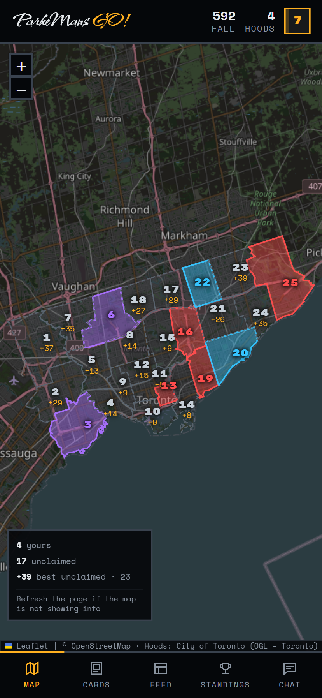
</p>

Every one of Toronto's 25 wards is a **Hood**. Take a photo inside one, declare what's in
it, and it's yours — until somebody takes a better photo. Whoever has the most points when
the season ends gets to be smug about it.

We never say "ward". We're not monsters.

---

## The only rule you actually need to remember

Rock, paper, scissors — but it's about **what's in the photo**, not what took it. Phone,
drone, SLR, disposable camera you found in a drawer: all equal.

```
                  landmark
                  ▲       ╲
         beats   ╱         ╲   beats
                ╱           ▼
           person ◀───────── animal
                    beats
```

| Subject | What counts | Beats | Loses to |
|---|---|---|---|
| **landmark** | buildings, monuments, streets, the shawarma place | animal | person |
| **person** | selfies, friends, a stranger who said yes | landmark | animal |
| **animal** | anything with a pulse that isn't a person | person | landmark |

Yes, "is a pigeon standing on a storefront an animal or a landmark" has already come up.
No, it has not been resolved.

## Three things you can do to a Hood

| | When | You need | You get |
|---|---|---|---|
| **Conquer** | nobody holds it | any subject | its difficulty score, 5–50 |
| **Steal** | somebody else holds it | the subject that beats theirs | double its difficulty, 10–100 |
| **Reinforce** | you hold it, 72h since its last claim | the subject that beats **your own** | a flat 25, forever |

<table>
<tr>
<td width="50%">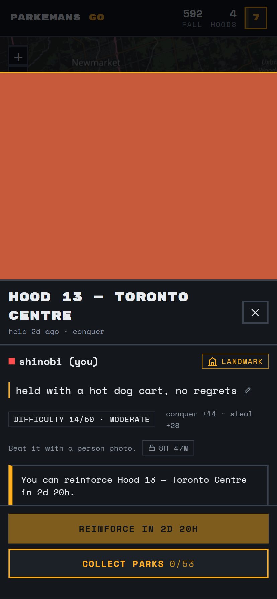</td>
<td width="50%">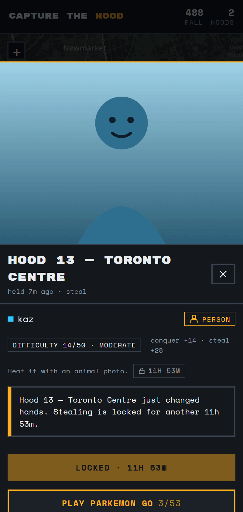</td>
</tr>
<tr>
<td align="center"><em>kaz has downtown. You'll need an animal.</em></td>
<td align="center"><em>Pick the subject <strong>before</strong> the camera opens, so nobody walks home with a useless photo.</em></td>
</tr>
</table>

**Not all Hoods are equal.** Each carries a **difficulty score from 5 to 50**, worked out
from how far it is from City Hall and how few Hoods border it. University-Rosedale is a 5 —
you probably walked through it today. Scarborough-Rouge Park is a 50, because getting there
is a whole afternoon and everybody knows it.

**Steal from somebody and there's a 12-hour lock**, so you two can't trade the same Hood
back and forth all evening like a pair of idiots.

**Conquer empty ground and its neighbours close to you for 24 hours.** This rule exists
entirely because of drones. One flight should not hand somebody the whole west end.

---

## Parkemon GO

Every park in Toronto has the same municipal sign with the park's name on it. There are
**1,513 of them**. Photograph one and you collect that park, and it prints you a card.

<table>
<tr>
<td width="50%"></td>
<td width="50%">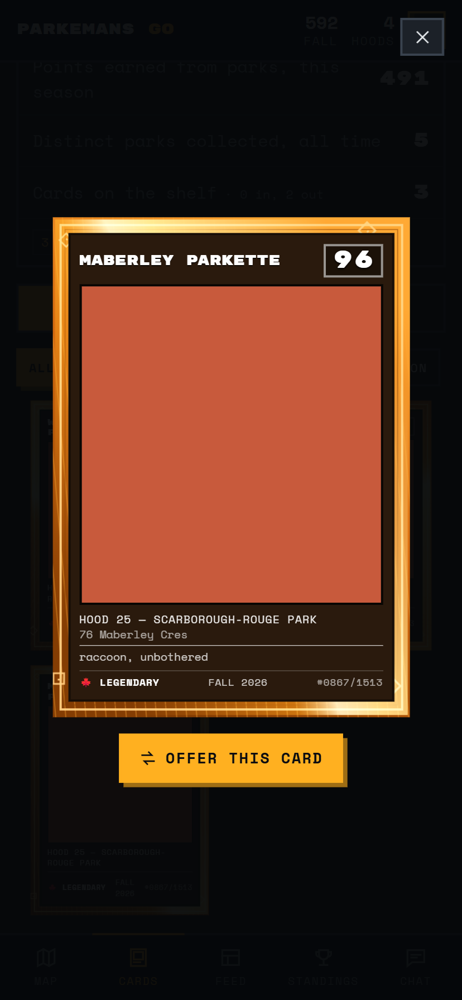</td>
</tr>
<tr>
<td align="center"><em>68 parks in Rouge Park alone. Sorted by value, because you're planning a route.</em></td>
<td align="center"><em>Card #0101 of 1513. Legendary. Not for sale.</em></td>
</tr>
</table>

- Parks are worth **5–100**, purely by how far out they are
- **Each park once a season, per player.** Everybody can collect the same park. Nobody owns
  one. There is nothing to fight over. It's the calm part of the game.
- The points go into the same total as territory, so you can genuinely win this thing
  without holding a single Hood, just by walking a lot
- **Rarity** comes off the value: Common, Uncommon, Rare, **Legendary**

The border on each card is unique to that card. The **season** picks the palette — Fall is
amber and rust, Winter goes ice blue, Spring green, Summer teal — and a seed derived from
(you, the park, the season) picks the hatch angle, the foil sweep and the corner
flourishes. Two people who collect the same park in the same season still get visibly
different cards. Legendaries get a slow sheen, because obviously they do.

<p align="center">
  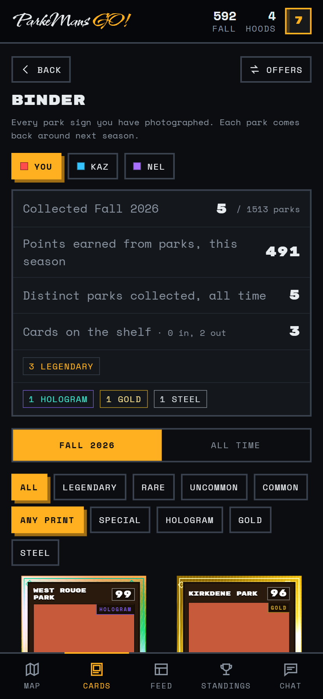
</p>

---

## XP, which never resets

Points are about **value**. XP is about **turning up**.

A steal is 70 XP, a conquer 50, a reinforce 20, a park 10 plus a bit for rarity. Going
somewhere you have **never been before** is worth +100 — which is the entire point, because
it means the person who has seen all 25 Hoods out-levels the person farming four of them
next to their flat, even if that person is winning on points.

<p align="center">
  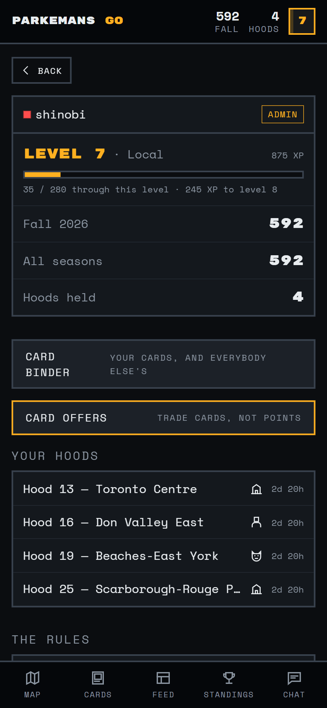
</p>

Levels need 20 × L × (L−1) XP, so level 2 arrives after a single claim and level 30 is
about a year of actually playing. There is **no level cap**, and XP **never resets** — not
at a season rollover, not ever. Your season score goes back to zero four times a year;
your level only goes up.

| Level | Title | | Level | Title |
|---|---|---|---|---|
| 1 | Tourist | | 20 | Institution |
| 5 | Local | | 30 | Landmark |
| 10 | Regular | | 40 | Legend |
| 15 | Fixture | | 55 | Mythic |

Level-ups announce themselves in chat, so everybody knows the moment you become an
Institution.

---

## Say something about it

Every photo can carry a line. Write it when you upload, or add it later from the feed —
it's the one thing in the whole game you're allowed to change your mind about.

<table>
<tr>
<td width="50%">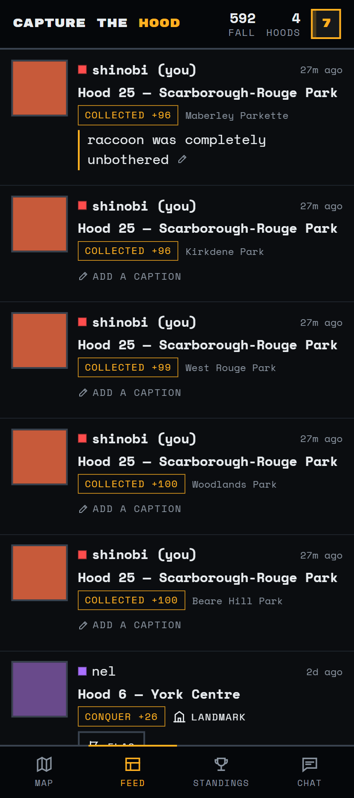</td>
<td width="50%">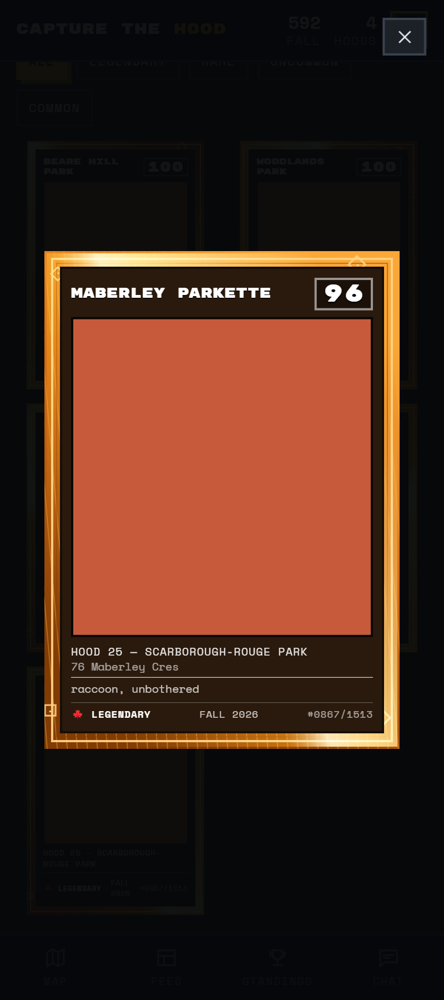</td>
</tr>
</table>

Your caption goes to chat with the claim, shows up under the photo everywhere the photo
shows up, and on a park card it gets printed along the bottom as **flavour text**, exactly
where a real card puts it. It's worth zero points. That's the point — it's the only place
in here to be funny instead of competitive.

---

## Make it yours

The profile screen has a **mode** switch and eight **accent** colours. Light mode isn't a
watered-down dark mode — it's the original ShinTech look, ink on paper, and honestly it's
the nicer one on a patio in July. The black chrome bars stay black in both, because they
looked right.

<table>
<tr>
<td width="50%">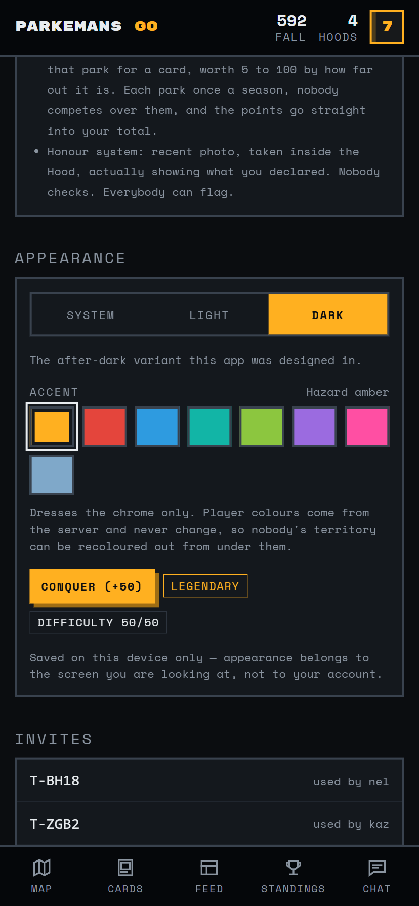</td>
<td width="50%">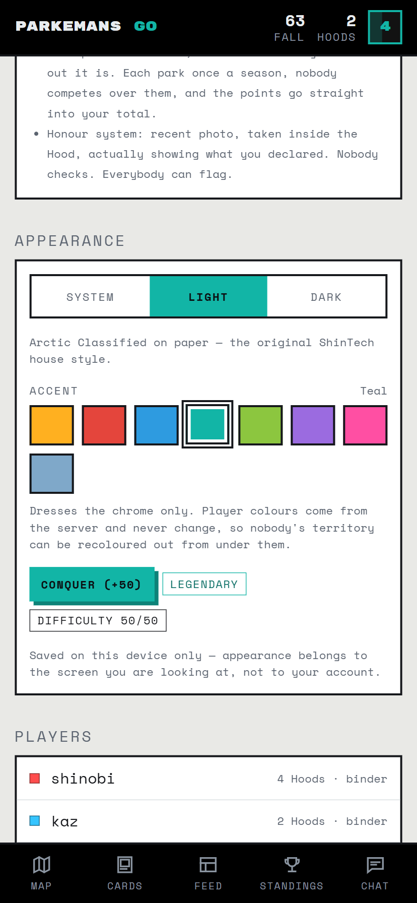</td>
</tr>
</table>

Your accent never touches anybody's **player** colour — those come from the server, so
nobody's territory can get recoloured out from under them. Pick hot pink; the map still
tells the truth.

The unglamorous half of this: hazard amber is gorgeous on black and completely illegible
on white, so an accent isn't one colour, it's five — the raw hex, a deepened version for
text, a darker one for the shadow, and a measured black-or-white for button labels. All
eight swatches clear WCAG AA in both themes, as text and as a fill, and there's a
Puppeteer pass that walks every screen and re-checks it so that stays true.

---

## The honour system, or: why this was easy to build

The server does **not** check where you were, when you took the photo, or whether that's
really a raccoon. It checks only what it can actually know: that the Hood exists, that your
subject beats theirs, that the cooldowns have elapsed.

Everything else is enforced by **flagging**. Two flags and a claim is reverted — points
cancelled, Hood handed back, and the whole accusation posted publicly in chat.

<p align="center">
  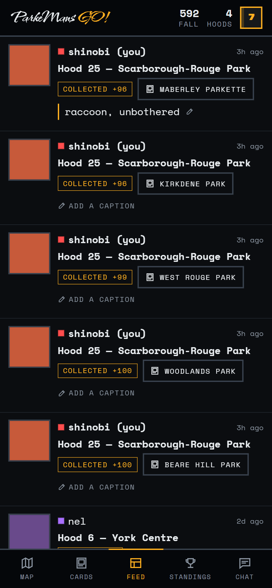
  <br><em>Every claim, with a flag button on it. One tap to start an argument.</em>
</p>

<table>
<tr>
<td width="50%">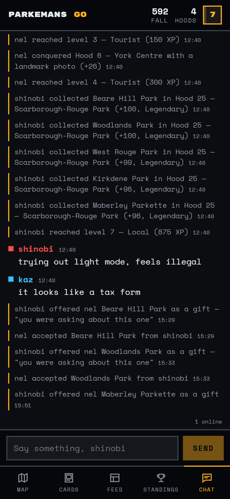</td>
<td width="50%">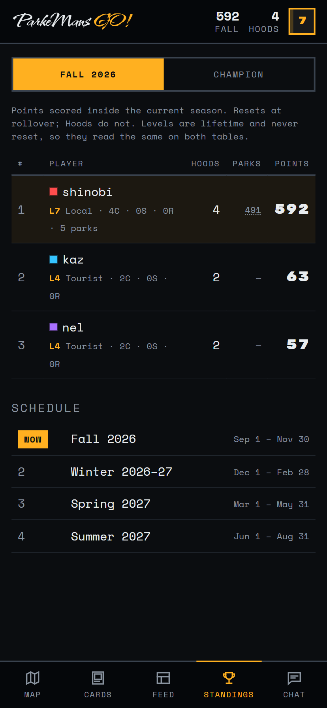</td>
</tr>
<tr>
<td align="center"><em>Chat is also the activity log. Every claim and every flag announces itself.</em></td>
<td align="center"><em>Territory and parks, summed. C / S / R is conquers, steals, reinforces.</em></td>
</tr>
</table>

This removed approximately all of the hard engineering from the project and replaced it
with social consequences. Highly recommended.

---

## Four seasons, then somebody wins

| # | Season | Runs |
|---|---|---|
| 1 | Fall 2026 | Sep 1 – Nov 30 |
| 2 | Winter 2026–27 | Dec 1 – Feb 28 |
| 3 | Spring 2027 | Mar 1 – May 31 |
| 4 | Summer 2027 | Jun 1 – Aug 31 |

At each rollover, season points reset to zero but **Hood ownership carries over** — and any
Hood that nobody has *ever* conquered becomes 25 points more valuable. An untouched Rouge
Park climbs 50 → 75 → 100 → 125 over the year, which is the mechanism by which one of us
eventually drives out there in February.

Four season winners, and one **Champion**: most points across all four. Both come out of
the same append-only ledger, because storing a running total is how you end up with a score
nobody can explain.

---

## Running your own

Node 20+. There is no cloud anything — it's one SQLite file and a Raspberry Pi.

```bash
npm run install:all      # server + web
npm run import-hoods     # the 25 Hood boundaries, from City of Toronto Open Data
npm run import-parks     # all 1,513 park signs (needs the Hoods first)
npm run invite           # mint a code — whoever uses it first becomes the admin
npm run build
npm start                # http://localhost:8096
```

Then open it on a phone and **Add to Home Screen**, because the capture flow is the entire
point and it feels wrong in a browser tab.

```bash
npm test                 # 140 tests, no server needed, touches nothing in data/
```

| Command | Does what |
|---|---|
| `npm run import-hoods` | Fetches the ward boundaries, simplifies 1.1 MB down to 66 kB, works out each Hood's difficulty and which Hoods border which |
| `npm run import-parks` | Fetches every park, files each under the Hood it sits in, scores it 5–100 |
| `npm run rollover` | Checks whether the season has ended. Idempotent. `--dry-run` to peek |
| `npm run invite [n]` | More invite codes |
| `npm run dev` + `npm run dev:web` | API on 8096, Vite on 5173 |

## What it's made of

Node · Express · SQLite (`better-sqlite3`) · `ws` · `sharp` · argon2 · React · Vite · Leaflet

**No API keys anywhere.** The basemap is plain OpenStreetMap raster darkened with a CSS
filter, because CARTO's dark tiles now stamp "API KEY REQUIRED" across the whole city.

The look is *Arctic Classified after dark* — the house style from shintech.online, inverted
for something you use outdoors at night. No rounded corners, 2px ink borders, hard offset
shadows instead of glows, Space Mono throughout, and exactly one accent colour (hazard
amber) because the map already spends every other colour on somebody's territory.

## Where everything lives

```
server/lib/game.js    ←  the claim state machine. This is the game.
server/lib/parks.js      Parkemon: collection rules, card seeds, the binder
server/lib/views.js      read models; every score derived from the ledger
server/lib/xp.js         XP, the level curve, the titles
web/src/components/ParkCard.jsx    the card art — inline SVG, seeded
scripts/                 the importers, the season rollover, icon generation
deploy/                  systemd units, nginx vhost, backups, install.sh
```

`server/lib/game.js` is the only file that decides who owns a Hood; everything else is
presentation. Deployment is in `SETUP.md`, the design doc is
`capture-the-hood-spec.md`, and the notes-to-self are in `CLAUDE.md`.

---

## Credits and small print

Hood boundaries and all 1,513 parks come from
[City of Toronto Open Data](https://open.toronto.ca/), used under the
[Open Government Licence – Toronto](https://open.toronto.ca/open-data-license/). Map tiles
© [OpenStreetMap](https://www.openstreetmap.org/copyright) contributors. Type is Rubik Mono
One and Space Mono, both under the SIL Open Font License.

Built by [ShinTech Electronics](https://shintech.online) for a group chat that would not
stop arguing about whose neighbourhood was better.

Now go outside.
